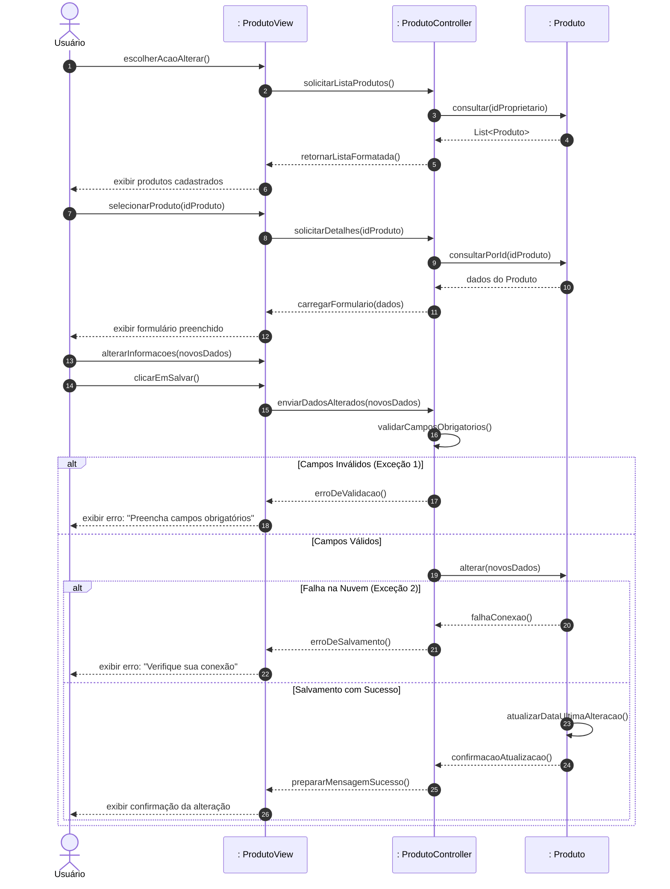

```mermaid
sequenceDiagram
    autonumber
    
    actor U as Usuário
    participant V as : ProdutoView
    participant C as : ProdutoController
    participant M as : Produto

    %% Fluxo de listagem e seleção
    U->>V: escolherAcaoAlterar()
    V->>C: solicitarListaProdutos()
    C->>M: consultar(idProprietario)
    M-->>C: List<Produto>
    C-->>V: retornarListaFormatada()
    V-->>U: exibir produtos cadastrados

    %% Seleção do produto e exibição do formulário
    U->>V: selecionarProduto(idProduto)
    V->>C: solicitarDetalhes(idProduto)
    C->>M: consultarPorId(idProduto)
    M-->>C: dados do Produto
    C-->>V: carregarFormulario(dados)
    V-->>U: exibir formulário preenchido

    %% Alteração e submissão
    U->>V: alterarInformacoes(novosDados)
    U->>V: clicarEmSalvar()
    V->>C: enviarDadosAlterados(novosDados)

    %% Validação e Fluxos de Exceção
    C->>C: validarCamposObrigatorios()

    alt Campos Inválidos (Exceção 1)
        C-->>V: erroDeValidacao()
        V-->>U: exibir erro: "Preencha campos obrigatórios"
    else Campos Válidos
        C->>M: alterar(novosDados)
        
        alt Falha na Nuvem (Exceção 2)
            M-->>C: falhaConexao()
            C-->>V: erroDeSalvamento()
            V-->>U: exibir erro: "Verifique sua conexão"
        else Salvamento com Sucesso
            M->>M: atualizarDataUltimaAlteracao()
            M-->>C: confirmacaoAtualizacao()
            C-->>V: prepararMensagemSucesso()
            V-->>U: exibir confirmação da alteração
        end
    end
```