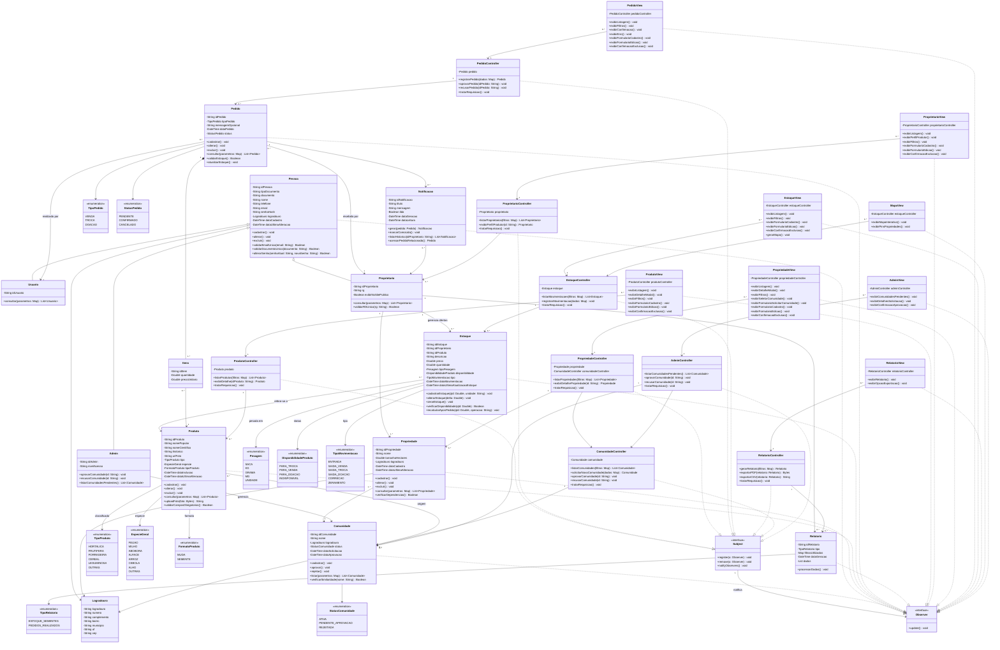

```mermaid
classDiagram
    direction TB

    %% ================= PADRÃO OBSERVER =================
    
    class Subject {
        <<interface>>
        +register(o: Observer) void
        +remove(o: Observer) void
        +notifyObservers() void
    }

    class Observer {
        <<interface>>
        +update() void
    }

    %% Sujeito notifica Observadores
    Subject "1" --> "0..*" Observer : notifica

    %% ================= MODEL =================

    class Pessoa {
        -String idPessoa
        -String tipoDocumento
        -String documento
        -String nome
        -String telefone
        -String email
        -String senhaHash
        -Logradouro logradouro
        -DateTime dataCadastro
        -DateTime dataUltimaAlteracao
        +cadastrar() void
        +alterar() void
        +excluir() void
        +validarEmailUnico(email: String) Boolean
        +validarDocumentoUnico(documento: String) Boolean
        +alterarSenha(senhaAtual: String, novaSenha: String) Boolean
    }

    class Usuario {
        -String idUsuario
        +consultar(parametros: Map) List~Usuario~
    }

    class Proprietario {
        -String idProprietario
        -String rg
        -Boolean exibirNoSitePublico
        +consultar(parametros: Map) List~Proprietario~
        +validarRGUnico(rg: String) Boolean
    }

    class Admin {
        -String idAdmin
        -String nivelAcesso
        +aprovarComunidade(id: String) void
        +recusarComunidade(id: String) void
        +listarComunidadesPendentes() List~Comunidade~
    }

    class Logradouro {
        -String logradouro
        -String numero
        -String complemento
        -String bairro
        -String municipio
        -String uf
        -String cep
    }

    class Comunidade {
        -String idComunidade
        -String nome
        -Logradouro logradouro
        -StatusComunidade status
        -DateTime dataSolicitacao
        -DateTime dataAprovacao
        +cadastrar() void
        +aprovar() void
        +rejeitar() void
        +listar(parametros: Map) List~Comunidade~
        +verificarSimilaridade(nome: String) Boolean
    }

    class StatusComunidade {
        <<enumeration>>
        ATIVA
        PENDENTE_APROVACAO
        REJEITADA
    }

    class Propriedade {
        -String idPropriedade
        -String nome
        -Double tamanhoHectares
        -Logradouro logradouro
        -DateTime dataCadastro
        -DateTime dataUltimaAlteracao
        +cadastrar() void
        +alterar() void
        +excluir() void
        +consultar(parametros: Map) List~Propriedade~
        +verificarDependencias() Boolean
    }

    class Produto {
        -String idProduto
        -String nomePopular
        -String nomeCientifico
        -String historico
        -String urlFoto
        -TipoProduto tipo
        -EspecieGeral especie
        -FormatoProduto tipoProduto
        -DateTime dataInclusao
        -DateTime dataUltimaAlteracao
        +cadastrar() void
        +alterar() void
        +excluir() void
        +consultar(parametros: Map) List~Produto~
        +uploadFoto(foto: Bytes) String
        +validarCamposObrigatorios() Boolean
    }

    class TipoProduto {
        <<enumeration>>
        HORTALICA
        FRUTIFERA
        FORRAGEIRA
        CEREAL
        LEGUMINOSA
        OUTRAS
    }

    class EspecieGeral {
        <<enumeration>>
        FEIJAO
        MILHO
        ABOBORA
        ALFACE
        ARROZ
        CEBOLA
        ALHO
        OUTRAS
    }

    class FormatoProduto {
        <<enumeration>>
        MUDA
        SEMENTE
    }

    class Pesagem {
        <<enumeration>>
        SACA
        KG
        GRAMA
        MG
        UNIDADE
    }

    class DisponibilidadeProduto {
        <<enumeration>>
        PARA_TROCA
        PARA_VENDA
        PARA_DOACAO
        INDISPONIVEL
    }

    class Estoque {
        -String idEstoque
        -String idProprietario
        -String idProduto
        -String descricao
        -Double preco
        -Double quantidade
        -Pesagem tipoPesagem
        -DisponibilidadeProduto disponibilidade
        -TipoMovimentacao tipo
        -DateTime dataMovimentacao
        -DateTime dataUltimaAtualizacaoEstoque
        +cadastrarEstoque(qtd: Double, unidade: String) void
        +alterarEstoque(delta: Double) void
        +zerarEstoque() void
        +verificarDisponibilidade(qtd: Double) Boolean
        +recalcularAposPedido(qtd: Double, operacao: String) void
    }

    class TipoMovimentacao {
        <<enumeration>>
        ENTRADA
        SAIDA_VENDA
        SAIDA_TROCA
        SAIDA_DOACAO
        CORRECAO
        ZERAMENTO
    }

    class Pedido {
        -String idPedido
        -TipoPedido tipoPedido
        -String mensagemOpcional
        -DateTime dataPedido
        -StatusPedido status
        +cadastrar() void
        +alterar() void
        +excluir() void
        +consultar(parametros: Map) List~Pedido~
        +validarEstoque() Boolean
        +atualizarEstoque() void
    }

    class Itens {
        -String idItem
        -Double quantidade
        -Double precoUnitario
    }

    class TipoPedido {
        <<enumeration>>
        VENDA
        TROCA
        DOACAO
    }

    class StatusPedido {
        <<enumeration>>
        PENDENTE
        CONFIRMADO
        CANCELADO
    }

    class Notificacao {
        -String idNotificacao
        -String titulo
        -String mensagem
        -Boolean lida
        -DateTime dataGeracao
        -DateTime dataLeitura
        +gerar(pedido: Pedido) Notificacao
        +marcarComoLida() void
        +listarHistorico(idProprietario: String) List~Notificacao~
        +acessarPedidoRelacionado() Pedido
    }

    class Relatorio {
        -String idRelatorio
        -TipoRelatorio tipo
        -Map filtrosUtilizados
        -DateTime dataGeracao
        -List dados
        +processarDados() void
    }

    class TipoRelatorio {
        <<enumeration>>
        ESTOQUE_SEMENTES
        PEDIDOS_REALIZADOS
    }

    %% ================= CONTROLLERS =================

    class ProdutoController {
        -Produto produto
        +listarProdutos(filtros: Map) List~Produto~
        +exibirDetalhe(idProduto: String) Produto
        +tratarRequisicao() void
    }

    class ProprietarioController {
        -Proprietario proprietario
        +listarProprietarios(filtros: Map) List~Proprietario~
        +exibirPerfilProdutor(id: String) Proprietario
        +tratarRequisicao() void
    }

    class PropriedadeController {
        -Propriedade propriedade
        -ComunidadeController comunidadeController
        +listarPropriedades(filtros: Map) List~Propriedade~
        +exibirDetalhePropriedade(id: String) Propriedade
        +tratarRequisicao() void
    }

    class PedidoController {
        -Pedido pedido
        +registrarPedido(dados: Map) Pedido
        +aprovarPedido(idPedido: String) void
        +recusarPedido(idPedido: String) void
        +tratarRequisicao() void
    }

    class RelatorioController {
        +gerarRelatorio(filtros: Map) Relatorio
        +exportarPDF(relatorio: Relatorio) Bytes
        +exportarCSV(relatorio: Relatorio) String
        +tratarRequisicao() void
    }

    class ComunidadeController {
        -Comunidade comunidade
        +listarComunidades(filtros: Map) List~Comunidade~
        +solicitarNovaComunidade(dados: Map) Comunidade
        +aprovarComunidade(id: String) void
        +recusarComunidade(id: String) void
        +tratarRequisicao() void
    }

    class AdminController {
        +listarComunidadesPendentes() List~Comunidade~
        +aprovarComunidade(id: String) void
        +recusarComunidade(id: String) void
        +tratarRequisicao() void
    }

    class EstoqueController {
        -Estoque estoque
        +listarMovimentacoes(filtros: Map) List~Estoque~
        +registrarMovimentacao(dados: Map) void
        +tratarRequisicao() void
    }

    %% ================= VIEWS =================

    class ProdutoView {
        -ProdutoController produtoController
        +exibirListagem() void
        +exibirDetalheModal() void
        +exibirFiltros() void
        +exibirFormularioCadastro() void
        +exibirFormularioEdicao() void
        +exibirConfirmacaoExclusao() void
    }

    class ProprietarioView {
        -ProprietarioController proprietarioController
        +exibirListagem() void
        +exibirPerfilProdutor() void
        +exibirFiltros() void
        +exibirFormularioCadastro() void
        +exibirFormularioEdicao() void
        +exibirConfirmacaoExclusao() void
    }

    class PropriedadeView {
        -PropriedadeController propriedadeController
        +exibirListagem() void
        +exibirDetalheModal() void
        +exibirFiltros() void
        +exibirSeletorComunidade() void
        +exibirFormularioSolicitarComunidade() void
        +exibirFormularioCadastro() void
        +exibirFormularioEdicao() void
        +exibirConfirmacaoExclusao() void
    }

    class PedidoView {
        -PedidoController pedidoController
        +exibirListagem() void
        +exibirFiltros() void
        +exibirConfirmacao() void
        +exibirErro() void
        +exibirFormularioCadastro() void
        +exibirFormularioEdicao() void
        +exibirConfirmacaoExclusao() void
    }

    class EstoqueView {
        -EstoqueController estoqueController
        +exibirListagem() void
        +exibirFiltros() void
        +exibirFormularioCadastro() void
        +exibirFormularioEdicao() void
        +exibirConfirmacaoExclusao() void
        +gerarMapa() void
    }

    class RelatorioView {
        -RelatorioController relatorioController
        +exibirRelatorio() void
        +exibirOpcaoExportacao() void
    }

    class MapaView {
        -EstoqueController estoqueController
        +exibirMapaInterativo() void
        +exibirPinsPropriedades() void
    }

    class AdminView {
        -AdminController adminController
        +exibirComunidadesPendentes() void
        +exibirDetalhesSolicitacao() void
        +exibirConfirmacaoAprovacao() void
    }

    %% ================= RELATIONSHIPS =================

    %% Implementação do Padrão Observer (Controllers -> Subject)
    ProdutoController ..|> Subject
    ProprietarioController ..|> Subject
    PropriedadeController ..|> Subject
    PedidoController ..|> Subject
    EstoqueController ..|> Subject
    RelatorioController ..|> Subject
    ComunidadeController ..|> Subject
    AdminController ..|> Subject

    %% Implementação do Padrão Observer (Models -> Observer)
    Pessoa ..|> Observer
    Comunidade ..|> Observer
    Propriedade ..|> Observer
    Produto ..|> Observer
    Estoque ..|> Observer
    Pedido ..|> Observer
    Relatorio ..|> Observer

    %% Implementação do Padrão Observer (Views -> Observer)
    ProdutoView ..|> Observer
    ProprietarioView ..|> Observer
    PropriedadeView ..|> Observer
    PedidoView ..|> Observer
    EstoqueView ..|> Observer
    RelatorioView ..|> Observer
    MapaView ..|> Observer
    AdminView ..|> Observer

    %% Herança e Localização (Model)
    Pessoa <|-- Usuario
    Pessoa <|-- Proprietario
    Pessoa <|-- Admin
    Pessoa --> Logradouro
    Propriedade --> Logradouro
    Comunidade --> Logradouro
    Comunidade --> StatusComunidade

    %% Relacionamentos do Domínio
    Proprietario "1" --> "1..*" Propriedade
    Propriedade "1..*" --> "1" Comunidade
    Admin --> Comunidade : gerencia

    %% Produto e Estoque (Estoque como elo central)
    Proprietario "1" --> "0..*" Estoque : gerencia ofertas
    Estoque "0..*" --> "1" Produto : refere-se a
    Produto "0..*" --> "1" Comunidade : origem

    Produto --> TipoProduto : classificada
    Produto --> EspecieGeral : especie
    Produto --> FormatoProduto : formato
    Estoque --> DisponibilidadeProduto : status
    Estoque --> Pesagem : pesada em
    Estoque --> TipoMovimentacao : tipo

    %% Pedido
    Pedido "1" *-- "1..*" Itens
    Itens "0..*" --> "1" Produto
    Pedido "0..*" --> "1" Usuario : realizado por
    Pedido "0..*" --> "1" Proprietario : recebido por
    Pedido --> TipoPedido
    Pedido --> StatusPedido
    Pedido "1" --> "0..*" Notificacao
    Notificacao "0..*" --> "1" Proprietario
    
    Proprietario "1" --> "0..*" Relatorio
    Relatorio --> TipoRelatorio

    %% Relacionamentos MVC (Views -> Controllers)
    ProdutoView "0..*" --> "1" ProdutoController
    ProprietarioView "0..*" --> "1" ProprietarioController
    PropriedadeView "0..*" --> "1" PropriedadeController
    PedidoView "0..*" --> "1" PedidoController
    EstoqueView "0..*" --> "1" EstoqueController
    RelatorioView "0..*" --> "1" RelatorioController
    MapaView "0..*" --> "1" EstoqueController
    AdminView "0..*" --> "1" AdminController

    %% Integração entre Controllers
    PropriedadeController --> ComunidadeController
    AdminController --> ComunidadeController

    %% Relacionamentos MVC (Controllers -> Models)
    ProdutoController "1" --> "0..*" Produto
    ProprietarioController "1" --> "0..*" Proprietario
    PropriedadeController "1" --> "0..*" Propriedade
    PedidoController "1" --> "0..*" Pedido
    ComunidadeController "1" --> "0..*" Comunidade
    AdminController "1" --> "0..*" Comunidade
    EstoqueController "1" --> "0..*" Estoque
    RelatorioController "1" --> "0..*" Relatorio
```