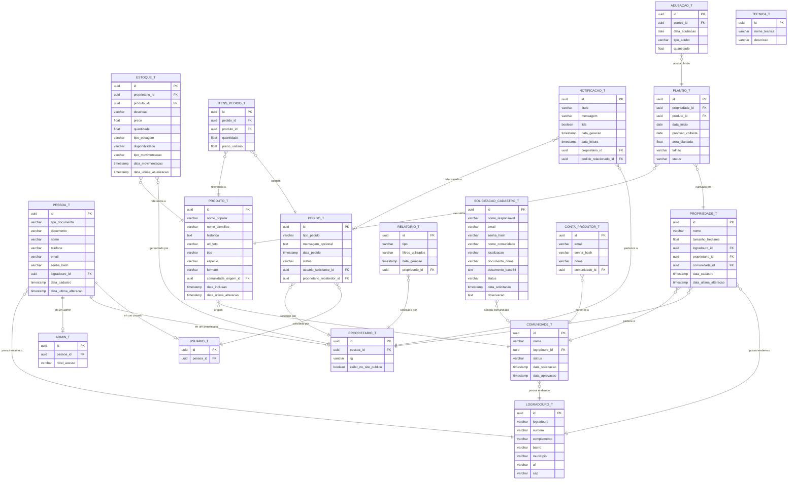
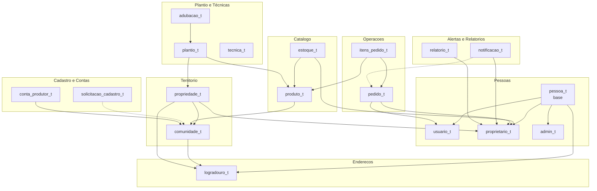

# Modelo Conceitual do Banco de Dados — Semente Livre

**Banco de Dados:** PostgreSQL 15+ (via Supabase) · Firestore (front-app)  
**SGBD:** PostgreSQL 15+ / Cloud Firestore  
**Método de Modelagem:** Mer (Modelo Entidade-Relacionamento)  
**Padrão de Nomenclatura:** snake_case (PostgreSQL), camelCase (Firestore)  
**Versão:** 2.0  

---

## 1. Visão Geral

O banco de dados do Semente Livre é responsável por persistir todas as informações do sistema de gestão de bancos de sementes crioulas. O modelo foi projetado para:

- Garantir integridade referencial em todas as operações
- Suportar herança de entidades (Pessoa → Proprietario/Admin)
- Rastrear auditoria completa (criação e alteração)
- Otimizar consultas comuns do sistema (listagens, filtros, relatórios)
- Respeitar as regras de negócio definidas nos Casos de Uso

**Estratégia de persistência por frontend:**
- **front-app (PWA):** Utiliza Firestore diretamente via Firebase SDK. As coleções seguem o modelo relacional com IDs gerados pelo Firestore.
- **front-site (Site):** Utiliza API routes Next.js conectadas ao PostgreSQL (Supabase). O modelo relacional abaixo é a fonte de verdade para este frontend.

---

## 2. Diagrama Entidade-Relacionamento (MER)



---

## 3. Dicionário de Dados

### 3.1 Tabelas Principais

#### `pessoa_t` — Tabela base de pessoas

| Coluna | Tipo | Constraints | Descrição |
|--------|------|-------------|-----------|
| `id` | UUID | PK, DEFAULT gen_random_uuid() | Identificador único da pessoa |
| `tipo_documento` | VARCHAR(5) | NOT NULL | Tipo do documento: 'CPF' ou 'CNPJ' |
| `documento` | VARCHAR(14) | NOT NULL, UNIQUE | Número do documento (CPF: 11 dígitos, CNPJ: 14 dígitos) |
| `nome` | VARCHAR(150) | NOT NULL | Nome completo da pessoa |
| `telefone` | VARCHAR(15) | | Telefone para contato (formato: (XX) XXXXX-XXXX) |
| `email` | VARCHAR(255) | NOT NULL, UNIQUE | Endereço de e-mail (usado para login) |
| `senha_hash` | VARCHAR(255) | NOT NULL | Senha com hash (BCrypt) |
| `logradouro_id` | UUID | FK → logradouro_t.id | Endereço da pessoa |
| `data_cadastro` | TIMESTAMP | NOT NULL, DEFAULT NOW() | Data e hora do cadastro |
| `data_ultima_alteracao` | TIMESTAMP | NOT NULL, DEFAULT NOW() | Data e hora da última alteração |

**Índices:**
- `idx_pessoa_documento` UNIQUE ON (tipo_documento, documento)
- `idx_pessoa_email` UNIQUE ON (email)
- `idx_pessoa_logradouro` ON (logradouro_id)

---

#### `usuario_t` — Usuários do sistema (herda de pessoa)

| Coluna | Tipo | Constraints | Descrição |
|--------|------|-------------|-----------|
| `id` | UUID | PK, DEFAULT gen_random_uuid() | Identificador único do usuário |
| `pessoa_id` | UUID | FK → pessoa_t.id, NOT NULL, UNIQUE | Referência à pessoa (1:1) |

**Regra de negócio:** Um usuário é uma pessoa que pode realizar pedidos no sistema.

---

#### `proprietario_t` — Produtores rurais (herda de pessoa)

| Coluna | Tipo | Constraints | Descrição |
|--------|------|-------------|-----------|
| `id` | UUID | PK, DEFAULT gen_random_uuid() | Identificador único do proprietário |
| `pessoa_id` | UUID | FK → pessoa_t.id, NOT NULL, UNIQUE | Referência à pessoa (1:1) |
| `rg` | VARCHAR(20) | NOT NULL, UNIQUE | Registro Geral do proprietário |
| `exibir_no_site_publico` | BOOLEAN | NOT NULL, DEFAULT false | Se true, perfil aparece no site público |

**Índices:**
- `idx_proprietario_rg` UNIQUE ON (rg)
- `idx_proprietario_pessoa` UNIQUE ON (pessoa_id)

---

#### `admin_t` — Administradores do sistema (herda de pessoa)

| Coluna | Tipo | Constraints | Descrição |
|--------|------|-------------|-----------|
| `id` | UUID | PK, DEFAULT gen_random_uuid() | Identificador único do admin |
| `pessoa_id` | UUID | FK → pessoa_t.id, NOT NULL, UNIQUE | Referência à pessoa (1:1) |
| `nivel_acesso` | VARCHAR(20) | NOT NULL, DEFAULT 'ADMIN' | Nível de acesso: 'SUPER_ADMIN', 'ADMIN', 'MODERADOR' |

---

#### `logradouro_t` — Endereços

| Coluna | Tipo | Constraints | Descrição |
|--------|------|-------------|-----------|
| `id` | UUID | PK, DEFAULT gen_random_uuid() | Identificador único do logradouro |
| `logradouro` | VARCHAR(255) | NOT NULL | Nome da rua/avenida/caminho |
| `numero` | VARCHAR(10) | | Número do imóvel |
| `complemento` | VARCHAR(100) | | Complemento (casa, apto, etc.) |
| `bairro` | VARCHAR(100) | | Bairro ou comunidade |
| `municipio` | VARCHAR(100) | NOT NULL | Município |
| `uf` | VARCHAR(2) | NOT NULL | Unidade Federativa (2 caracteres) |
| `cep` | VARCHAR(9) | | CEP (formato: XXXXX-XXX) |

**Nota:** Tabela compartilhada por pessoa, comunidade e propriedade.

---

#### `comunidade_t` — Comunidades quilombolas

| Coluna | Tipo | Constraints | Descrição |
|--------|------|-------------|-----------|
| `id` | UUID | PK, DEFAULT gen_random_uuid() | Identificador único da comunidade |
| `nome` | VARCHAR(150) | NOT NULL | Nome da comunidade |
| `logradouro_id` | UUID | FK → logradouro_t.id | Endereço da comunidade |
| `status` | VARCHAR(25) | NOT NULL, DEFAULT 'PENDENTE_APROVACAO' | Status: 'ATIVA', 'PENDENTE_APROVACAO', 'REJEITADA' |
| `data_solicitacao` | TIMESTAMP | NOT NULL, DEFAULT NOW() | Data em que foi solicitada |
| `data_aprovacao` | TIMESTAMP | | Data da aprovação (null se pendente) |

**Índices:**
- `idx_comunidade_status` ON (status)
- `idx_comunidade_nome` ON (nome)

**Restrição de negócio:** O nome da comunidade deve ser verificado para similaridade antes do cadastro (CDU-21).

---

#### `propriedade_t` — Propriedades rurais

| Coluna | Tipo | Constraints | Descrição |
|--------|------|-------------|-----------|
| `id` | UUID | PK, DEFAULT gen_random_uuid() | Identificador único da propriedade |
| `nome` | VARCHAR(150) | NOT NULL | Nome da propriedade |
| `tamanho_hectares` | DOUBLE PRECISION | NOT NULL | Tamanho em hectares |
| `logradouro_id` | UUID | FK → logradouro_t.id | Endereço da propriedade |
| `proprietario_id` | UUID | FK → proprietario_t.id, NOT NULL | Proprietário dono da terra |
| `comunidade_id` | UUID | FK → comunidade_t.id, NOT NULL | Comunidade à qual pertence |
| `data_cadastro` | TIMESTAMP | NOT NULL, DEFAULT NOW() | Data do cadastro |
| `data_ultima_alteracao` | TIMESTAMP | NOT NULL, DEFAULT NOW() | Última alteração |

**Índices:**
- `idx_propriedade_proprietario` ON (proprietario_id)
- `idx_propriedade_comunidade` ON (comunidade_id)

**Regra de negócio:** Exclusão bloqueada se houver estoque ou pedidos vinculados (CDU-04).

---

#### `produto_t` — Sementes e mudas

| Coluna | Tipo | Constraints | Descrição |
|--------|------|-------------|-----------|
| `id` | UUID | PK, DEFAULT gen_random_uuid() | Identificador único do produto |
| `nome_popular` | VARCHAR(150) | NOT NULL | Nome popular da semente/muda |
| `nome_cientifico` | VARCHAR(200) | | Nome científico (nome botânico) |
| `historico` | TEXT | | Histórico e informações sobre a semente |
| `url_foto` | VARCHAR(500) | NOT NULL | URL da foto armazenada no Supabase Storage |
| `tipo` | VARCHAR(15) | NOT NULL | Tipo: 'HORTALICA', 'FRUTIFERA', 'FORRAGEIRA', 'CEREAL', 'LEGUMINOSA', 'VERDURA', 'MEDICINAL', 'OUTRAS' |
| `especie` | VARCHAR(15) | NOT NULL | Espécie: 'FEIJAO', 'MILHO', 'ABOBORA', 'ALFACE', 'ARROZ', 'CEBOLA', 'ALHO', 'OUTRAS' |
| `formato` | VARCHAR(10) | NOT NULL | Formato: 'MUDA', 'SEMENTE' |
| `familia_botanica` | VARCHAR(100) | | Família botânica da planta |
| `comunidade_origem_id` | UUID | FK → comunidade_t.id | Comunidade de origem do produto |
| `data_inclusao` | TIMESTAMP | NOT NULL, DEFAULT NOW() | Data de inclusão no catálogo |
| `data_ultima_alteracao` | TIMESTAMP | NOT NULL, DEFAULT NOW() | Última alteração |

**Índices:**
- `idx_produto_tipo` ON (tipo)
- `idx_produto_especie` ON (especie)
- `idx_produto_nome_popular` ON (nome_popular)
- `idx_produto_comunidade_origem` ON (comunidade_origem_id)

---

#### `estoque_t` — Estoque de sementes por proprietário

| Coluna | Tipo | Constraints | Descrição |
|--------|------|-------------|-----------|
| `id` | UUID | PK, DEFAULT gen_random_uuid() | Identificador único do registro de estoque |
| `proprietario_id` | UUID | FK → proprietario_t.id, NOT NULL | Proprietário dono do estoque |
| `produto_id` | UUID | FK → produto_t.id, NOT NULL | Produto em estoque |
| `descricao` | VARCHAR(255) | | Descrição adicional da offer |
| `preco` | DOUBLE PRECISION | | Preço unitário (null para doação) |
| `quantidade` | DOUBLE PRECISION | NOT NULL, DEFAULT 0 | Quantidade em estoque |
| `tipo_pesagem` | VARCHAR(10) | NOT NULL | Unidade: 'SACA', 'KG', 'GRAMA', 'MG', 'UNIDADE' |
| `disponibilidade` | VARCHAR(15) | NOT NULL, DEFAULT 'INDISPONIVEL' | Status: 'PARA_TROCA', 'PARA_VENDA', 'PARA_DOACAO', 'A_NEGOCIAR', 'INDISPONIVEL' |
| `tipo_movimentacao` | VARCHAR(20) | NOT NULL, DEFAULT 'ENTRADA' | Última movimentação: 'ENTRADA', 'SAIDA_VENDA', 'SAIDA_TROCA', 'SAIDA_DOACAO', 'CORRECAO', 'ZERAMENTO' |
| `data_movimentacao` | TIMESTAMP | NOT NULL, DEFAULT NOW() | Data da última movimentação |
| `data_ultima_atualizacao` | TIMESTAMP | NOT NULL, DEFAULT NOW() | Data da última atualização do saldo |

**Índices:**
- `idx_estoque_proprietario` ON (proprietario_id)
- `idx_estoque_produto` ON (produto_id)
- `idx_estoque_disponibilidade` ON (disponibilidade)
- `idx_estoque_proprietario_produto` UNIQUE ON (proprietario_id, produto_id) — Um proprietário só pode ter 1 registro de estoque por produto

**Regra de negócio:** Quantidade não pode ficar negativa. Subtração maior que estoque atual bloqueia a operação (CDU-23).

---

#### `pedido_t` — Pedidos de sementes

| Coluna | Tipo | Constraints | Descrição |
|--------|------|-------------|-----------|
| `id` | UUID | PK, DEFAULT gen_random_uuid() | Identificador único do pedido |
| `tipo_pedido` | VARCHAR(10) | NOT NULL | Tipo: 'VENDA', 'TROCA', 'DOACAO' |
| `mensagem_opcional` | TEXT | | Mensagem do solicitante ao proprietário |
| `data_pedido` | TIMESTAMP | NOT NULL, DEFAULT NOW() | Data e hora do pedido |
| `status` | VARCHAR(12) | NOT NULL, DEFAULT 'PENDENTE' | Status: 'PENDENTE', 'CONFIRMADO', 'CANCELADO' |
| `usuario_solicitante_id` | UUID | FK → usuario_t.id, NOT NULL | Usuário que fez o pedido |
| `proprietario_recebedor_id` | UUID | FK → proprietario_t.id, NOT NULL | Proprietário que recebe o pedido |

**Índices:**
- `idx_pedido_solicitante` ON (usuario_solicitante_id)
- `idx_pedido_recebedor` ON (proprietario_recebedor_id)
- `idx_pedido_status` ON (status)
- `idx_pedido_data` ON (data_pedido)

---

#### `itens_pedido_t` — Itens dentro de cada pedido

| Coluna | Tipo | Constraints | Descrição |
|--------|------|-------------|-----------|
| `id` | UUID | PK, DEFAULT gen_random_uuid() | Identificador único do item |
| `pedido_id` | UUID | FK → pedido_t.id, NOT NULL | Pedido ao qual pertence |
| `produto_id` | UUID | FK → produto_t.id, NOT NULL | Produto solicitado |
| `quantidade` | DOUBLE PRECISION | NOT NULL | Quantidade solicitada |
| `preco_unitario` | DOUBLE PRECISION | | Preço unitário no momento do pedido |

**Índices:**
- `idx_itens_pedido_pedido` ON (pedido_id)
- `idx_itens_pedido_produto` ON (produto_id)

**Regra de negócio:** Um pedido pode conter múltiplos itens (1:N). A exclusão de um pedido restaura o estoque (CDU-14).

---

#### `notificacao_t` — Notificações do sistema

| Coluna | Tipo | Constraints | Descrição |
|--------|------|-------------|-----------|
| `id` | UUID | PK, DEFAULT gen_random_uuid() | Identificador único da notificação |
| `titulo` | VARCHAR(255) | NOT NULL | Título da notificação |
| `mensagem` | TEXT | NOT NULL | Corpo da mensagem |
| `lida` | BOOLEAN | NOT NULL, DEFAULT false | Se a notificação foi lida |
| `data_geracao` | TIMESTAMP | NOT NULL, DEFAULT NOW() | Data de geração |
| `data_leitura` | TIMESTAMP | | Data em que foi lida (null se não lida) |
| `proprietario_id` | UUID | FK → proprietario_t.id, NOT NULL | Proprietário destinatário |
| `pedido_relacionado_id` | UUID | FK → pedido_t.id | Pedido que gerou a notificação |

**Índices:**
- `idx_notificacao_proprietario` ON (proprietario_id)
- `idx_notificacao_lida` ON (lida)
- `idx_notificacao_proprietario_lida` ON (proprietario_id, lida)

**Regra de negócio:** Notificação é gerada automaticamente ao concluir um pedido (CDU-26).

---

#### `plantio_t` — Registros de plantio (front-site)

| Coluna | Tipo | Constraints | Descrição |
|--------|------|-------------|-----------|
| `id` | UUID | PK, DEFAULT gen_random_uuid() | Identificador único do plantio |
| `propriedade_id` | UUID | FK → propriedade_t.id, NOT NULL | Propriedade onde está plantado |
| `produto_id` | UUID | FK → produto_t.id, NOT NULL | Semente/muda utilizada |
| `data_inicio` | DATE | NOT NULL, DEFAULT CURRENT_DATE | Data de início do plantio |
| `previsao_colheita` | DATE | | Previsão de colheita |
| `area_plantada` | DOUBLE PRECISION | | Área plantada (hectares) |
| `talhao` | VARCHAR(100) | | Nome/identificação do talhão |
| `status` | VARCHAR(15) | NOT NULL, DEFAULT 'ATIVO' | Status: 'ATIVO', 'CONCLUIDO', 'CANCELADO' |
| `data_cadastro` | TIMESTAMP | NOT NULL, DEFAULT NOW() | Data de cadastro do registro |

**Índices:**
- `idx_plantio_propriedade` ON (propriedade_id)
- `idx_plantio_produto` ON (produto_id)
- `idx_plantio_status` ON (status)

---

#### `adubacao_t` — Registro de adubações (front-site)

| Coluna | Tipo | Constraints | Descrição |
|--------|------|-------------|-----------|
| `id` | UUID | PK, DEFAULT gen_random_uuid() | Identificador único da adubação |
| `plantio_id` | UUID | FK → plantio_t.id, NOT NULL | Plantio ao qual se refere |
| `data_adubacao` | DATE | NOT NULL, DEFAULT CURRENT_DATE | Data da adubação |
| `tipo_adubo` | VARCHAR(100) | NOT NULL | Tipo de adubo utilizado |
| `quantidade` | DOUBLE PRECISION | NOT NULL, CHECK > 0 | Quantidade aplicada |

**Índices:**
- `idx_adubacao_plantio` ON (plantio_id)

---

#### `tecnica_t` — Técnicas agroecológicas (front-site)

| Coluna | Tipo | Constraints | Descrição |
|--------|------|-------------|-----------|
| `id` | UUID | PK, DEFAULT gen_random_uuid() | Identificador único da técnica |
| `nome_tecnica` | VARCHAR(150) | NOT NULL | Nome da técnica |
| `descricao` | TEXT | | Descrição detalhada da técnica |

---

#### `solicitacao_cadastro_t` — Solicitações de cadastro (front-site admin)

| Coluna | Tipo | Constraints | Descrição |
|--------|------|-------------|-----------|
| `id` | UUID | PK, DEFAULT gen_random_uuid() | Identificador único da solicitação |
| `nome_responsavel` | VARCHAR(150) | NOT NULL | Nome do responsável |
| `email` | VARCHAR(255) | NOT NULL | Email do solicitante |
| `senha_hash` | VARCHAR(255) | NOT NULL | Senha com hash |
| `nome_comunidade` | VARCHAR(150) | NOT NULL | Nome da comunidade |
| `localizacao` | VARCHAR(255) | | Localização da comunidade |
| `documento_nome` | VARCHAR(255) | | Nome do documento anexado |
| `documento_base64` | TEXT | | Documento em base64 |
| `status` | VARCHAR(15) | NOT NULL, DEFAULT 'PENDENTE' | Status: 'PENDENTE', 'APROVADA', 'REJEITADA' |
| `data_solicitacao` | TIMESTAMP | NOT NULL, DEFAULT NOW() | Data da solicitação |
| `observacao` | TEXT | | Observação do admin (motivo rejeição, etc.) |

**Índices:**
- `idx_solicitacao_status` ON (status)

---

#### `conta_produtor_t` — Contas de produtores (front-site)

| Coluna | Tipo | Constraints | Descrição |
|--------|------|-------------|-----------|
| `id` | UUID | PK, DEFAULT gen_random_uuid() | Identificador único da conta |
| `email` | VARCHAR(255) | NOT NULL, UNIQUE | Email do produtor |
| `senha_hash` | VARCHAR(255) | NOT NULL | Senha com hash |
| `nome` | VARCHAR(150) | NOT NULL | Nome do produtor |
| `comunidade_id` | UUID | FK → comunidade_t.id, NOT NULL | Comunidade vinculada |

**Índices:**
- `idx_conta_produtor_comunidade` ON (comunidade_id)

---

#### `relatorio_t` — Relatórios gerados

| Coluna | Tipo | Constraints | Descrição |
|--------|------|-------------|-----------|
| `id` | UUID | PK, DEFAULT gen_random_uuid() | Identificador único do relatório |
| `tipo` | VARCHAR(20) | NOT NULL | Tipo: 'ESTOQUE_SEMENTES', 'PEDIDOS_REALIZADOS' |
| `filtros_utilizados` | JSONB | | Filtros aplicados em formato JSON |
| `data_geracao` | TIMESTAMP | NOT NULL, DEFAULT NOW() | Data de geração |
| `proprietario_id` | UUID | FK → proprietario_t.id, NOT NULL | Proprietário que solicitou |

**Índices:**
- `idx_relatorio_proprietario` ON (proprietario_id)
- `idx_relatorio_tipo` ON (tipo)

---

## 4. Enums do PostgreSQL

```sql
-- Tipo de documento
CREATE TYPE tipo_documento_enum AS ENUM ('CPF', 'CNPJ');

-- Status da comunidade
CREATE TYPE status_comunidade_enum AS ENUM ('ATIVA', 'PENDENTE_APROVACAO', 'REJEITADA');

-- Tipo do produto
CREATE TYPE tipo_produto_enum AS ENUM ('HORTALICA', 'FRUTIFERA', 'FORRAGEIRA', 'CEREAL', 'LEGUMINOSA', 'VERDURA', 'MEDICINAL', 'OUTRAS');

-- Espécie geral
CREATE TYPE especie_geral_enum AS ENUM ('FEIJAO', 'MILHO', 'ABOBORA', 'ALFACE', 'ARROZ', 'CEBOLA', 'ALHO', 'OUTRAS');

-- Formato do produto
CREATE TYPE formato_produto_enum AS ENUM ('MUDA', 'SEMENTE');

-- Tipo de pesagem
CREATE TYPE pesagem_enum AS ENUM ('SACA', 'KG', 'GRAMA', 'MG', 'UNIDADE');

-- Disponibilidade do produto
CREATE TYPE disponibilidade_produto_enum AS ENUM ('PARA_TROCA', 'PARA_VENDA', 'PARA_DOACAO', 'A_NEGOCIAR', 'INDISPONIVEL');

-- Tipo de movimentação de estoque
CREATE TYPE tipo_movimentacao_enum AS ENUM ('ENTRADA', 'SAIDA_VENDA', 'SAIDA_TROCA', 'SAIDA_DOACAO', 'CORRECAO', 'ZERAMENTO');

-- Tipo de pedido
CREATE TYPE tipo_pedido_enum AS ENUM ('VENDA', 'TROCA', 'DOACAO');

-- Status do pedido
CREATE TYPE status_pedido_enum AS ENUM ('PENDENTE', 'CONFIRMADO', 'CANCELADO');

-- Tipo de relatório
CREATE TYPE tipo_relatorio_enum AS ENUM ('ESTOQUE_SEMENTES', 'PEDIDOS_REALIZADOS');

-- Nível de acesso do admin
CREATE TYPE nivel_acesso_enum AS ENUM ('SUPER_ADMIN', 'ADMIN', 'MODERADOR');
```

---

## 5. Script SQL de Criação (PostgreSQL)

```sql
-- =====================================================
-- SCRIPT DE CRIAÇÃO DO BANCO DE DADOS
-- SEMENTE LIVRE - PostgreSQL 15+
-- =====================================================

-- Extensões necessárias
CREATE EXTENSION IF NOT EXISTS "uuid-ossp";
CREATE EXTENSION IF NOT EXISTS "pgcrypto";

-- =====================================================
-- ENUMS
-- =====================================================

CREATE TYPE tipo_documento_enum AS ENUM ('CPF', 'CNPJ');
CREATE TYPE status_comunidade_enum AS ENUM ('ATIVA', 'PENDENTE_APROVACAO', 'REJEITADA');
CREATE TYPE tipo_produto_enum AS ENUM ('HORTALICA', 'FRUTIFERA', 'FORRAGEIRA', 'CEREAL', 'LEGUMINOSA', 'VERDURA', 'MEDICINAL', 'OUTRAS');
CREATE TYPE especie_geral_enum AS ENUM ('FEIJAO', 'MILHO', 'ABOBORA', 'ALFACE', 'ARROZ', 'CEBOLA', 'ALHO', 'OUTRAS');
CREATE TYPE formato_produto_enum AS ENUM ('MUDA', 'SEMENTE');
CREATE TYPE pesagem_enum AS ENUM ('SACA', 'KG', 'GRAMA', 'MG', 'UNIDADE');
CREATE TYPE disponibilidade_produto_enum AS ENUM ('PARA_TROCA', 'PARA_VENDA', 'PARA_DOACAO', 'A_NEGOCIAR', 'INDISPONIVEL');
CREATE TYPE tipo_movimentacao_enum AS ENUM ('ENTRADA', 'SAIDA_VENDA', 'SAIDA_TROCA', 'SAIDA_DOACAO', 'CORRECAO', 'ZERAMENTO');
CREATE TYPE tipo_pedido_enum AS ENUM ('VENDA', 'TROCA', 'DOACAO');
CREATE TYPE status_pedido_enum AS ENUM ('PENDENTE', 'CONFIRMADO', 'CANCELADO');
CREATE TYPE tipo_relatorio_enum AS ENUM ('ESTOQUE_SEMENTES', 'PEDIDOS_REALIZADOS');
CREATE TYPE nivel_acesso_enum AS ENUM ('SUPER_ADMIN', 'ADMIN', 'MODERADOR');

-- =====================================================
-- TABELAS
-- =====================================================

-- Tabela de logradouros (compartilhada)
CREATE TABLE logradouro_t (
    id UUID PRIMARY KEY DEFAULT gen_random_uuid(),
    logradouro VARCHAR(255) NOT NULL,
    numero VARCHAR(10),
    complemento VARCHAR(100),
    bairro VARCHAR(100),
    municipio VARCHAR(100) NOT NULL,
    uf CHAR(2) NOT NULL,
    cep VARCHAR(9),
    CONSTRAINT chk_uf CHECK (uf ~ '^[A-Z]{2}$')
);

COMMENT ON TABLE logradouro_t IS 'Endereços compartilhados por pessoas, comunidades e propriedades';

-- Tabela base de pessoas (herança por tabela)
CREATE TABLE pessoa_t (
    id UUID PRIMARY KEY DEFAULT gen_random_uuid(),
    tipo_documento tipo_documento_enum NOT NULL,
    documento VARCHAR(14) NOT NULL,
    nome VARCHAR(150) NOT NULL,
    telefone VARCHAR(15),
    email VARCHAR(255) NOT NULL,
    senha_hash VARCHAR(255) NOT NULL,
    logradouro_id UUID REFERENCES logradouro_t(id) ON DELETE SET NULL,
    data_cadastro TIMESTAMP NOT NULL DEFAULT NOW(),
    data_ultima_alteracao TIMESTAMP NOT NULL DEFAULT NOW(),
    CONSTRAINT uk_pessoa_documento UNIQUE (tipo_documento, documento),
    CONSTRAINT uk_pessoa_email UNIQUE (email),
    CONSTRAINT chk_documento_tamanho CHECK (
        (tipo_documento = 'CPF' AND LENGTH(documento) = 11) OR
        (tipo_documento = 'CNPJ' AND LENGTH(documento) = 14)
    )
);

COMMENT ON TABLE pessoa_t IS 'Tabela base de todas as pessoas do sistema';

CREATE INDEX idx_pessoa_logradouro ON pessoa_t(logradouro_id);

-- Tabela de usuários (herda identidade de pessoa)
CREATE TABLE usuario_t (
    id UUID PRIMARY KEY DEFAULT gen_random_uuid(),
    pessoa_id UUID NOT NULL REFERENCES pessoa_t(id) ON DELETE CASCADE,
    CONSTRAINT uk_usuario_pessoa UNIQUE (pessoa_id)
);

COMMENT ON TABLE usuario_t IS 'Usuários que podem realizar pedidos no sistema';

-- Tabela de proprietários (herda identidade de pessoa)
CREATE TABLE proprietario_t (
    id UUID PRIMARY KEY DEFAULT gen_random_uuid(),
    pessoa_id UUID NOT NULL REFERENCES pessoa_t(id) ON DELETE CASCADE,
    rg VARCHAR(20) NOT NULL,
    exibir_no_site_publico BOOLEAN NOT NULL DEFAULT false,
    CONSTRAINT uk_proprietario_pessoa UNIQUE (pessoa_id),
    CONSTRAINT uk_proprietario_rg UNIQUE (rg)
);

COMMENT ON TABLE proprietario_t IS 'Produtores rurais proprietários de sementes';

CREATE INDEX idx_proprietario_rg ON proprietario_t(rg);

-- Tabela de administradores (herda identidade de pessoa)
CREATE TABLE admin_t (
    id UUID PRIMARY KEY DEFAULT gen_random_uuid(),
    pessoa_id UUID NOT NULL REFERENCES pessoa_t(id) ON DELETE CASCADE,
    nivel_acesso nivel_acesso_enum NOT NULL DEFAULT 'ADMIN',
    CONSTRAINT uk_admin_pessoa UNIQUE (pessoa_id)
);

COMMENT ON TABLE admin_t IS 'Administradores do sistema';

-- Tabela de comunidades
CREATE TABLE comunidade_t (
    id UUID PRIMARY KEY DEFAULT gen_random_uuid(),
    nome VARCHAR(150) NOT NULL,
    logradouro_id UUID REFERENCES logradouro_t(id) ON DELETE SET NULL,
    status status_comunidade_enum NOT NULL DEFAULT 'PENDENTE_APROVACAO',
    data_solicitacao TIMESTAMP NOT NULL DEFAULT NOW(),
    data_aprovacao TIMESTAMP
);

COMMENT ON TABLE comunidade_t IS 'Comunidades quilombolas vinculadas ao sistema';

CREATE INDEX idx_comunidade_status ON comunidade_t(status);
CREATE INDEX idx_comunidade_nome ON comunidade_t(nome);

-- Tabela de propriedades
CREATE TABLE propriedade_t (
    id UUID PRIMARY KEY DEFAULT gen_random_uuid(),
    nome VARCHAR(150) NOT NULL,
    tamanho_hectares DOUBLE PRECISION NOT NULL CHECK (tamanho_hectares > 0),
    logradouro_id UUID REFERENCES logradouro_t(id) ON DELETE SET NULL,
    proprietario_id UUID NOT NULL REFERENCES proprietario_t(id) ON DELETE CASCADE,
    comunidade_id UUID NOT NULL REFERENCES comunidade_t(id) ON DELETE RESTRICT,
    data_cadastro TIMESTAMP NOT NULL DEFAULT NOW(),
    data_ultima_alteracao TIMESTAMP NOT NULL DEFAULT NOW()
);

COMMENT ON TABLE propriedade_t IS 'Propriedades rurais dos proprietários';

CREATE INDEX idx_propriedade_proprietario ON propriedade_t(proprietario_id);
CREATE INDEX idx_propriedade_comunidade ON propriedade_t(comunidade_id);

-- Tabela de produtos (sementes e mudas)
CREATE TABLE produto_t (
    id UUID PRIMARY KEY DEFAULT gen_random_uuid(),
    nome_popular VARCHAR(150) NOT NULL,
    nome_cientifico VARCHAR(200),
    historico TEXT,
    url_foto VARCHAR(500) NOT NULL,
    tipo tipo_produto_enum NOT NULL,
    especie especie_geral_enum NOT NULL,
    formato formato_produto_enum NOT NULL,
    familia_botanica VARCHAR(100),
    comunidade_origem_id UUID REFERENCES comunidade_t(id) ON DELETE SET NULL,
    data_inclusao TIMESTAMP NOT NULL DEFAULT NOW(),
    data_ultima_alteracao TIMESTAMP NOT NULL DEFAULT NOW()
);

COMMENT ON TABLE produto_t IS 'Sementes e mudas disponíveis no catálogo';

CREATE INDEX idx_produto_tipo ON produto_t(tipo);
CREATE INDEX idx_produto_especie ON produto_t(especie);
CREATE INDEX idx_produto_nome_popular ON produto_t(nome_popular);
CREATE INDEX idx_produto_comunidade_origem ON produto_t(comunidade_origem_id);

-- Tabela de estoque
CREATE TABLE estoque_t (
    id UUID PRIMARY KEY DEFAULT gen_random_uuid(),
    proprietario_id UUID NOT NULL REFERENCES proprietario_t(id) ON DELETE CASCADE,
    produto_id UUID NOT NULL REFERENCES produto_t(id) ON DELETE CASCADE,
    descricao VARCHAR(255),
    preco DOUBLE PRECISION CHECK (preco IS NULL OR preco >= 0),
    quantidade DOUBLE PRECISION NOT NULL DEFAULT 0 CHECK (quantidade >= 0),
    tipo_pesagem pesagem_enum NOT NULL,
    disponibilidade disponibilidade_produto_enum NOT NULL DEFAULT 'INDISPONIVEL',
    tipo_movimentacao tipo_movimentacao_enum NOT NULL DEFAULT 'ENTRADA',
    data_movimentacao TIMESTAMP NOT NULL DEFAULT NOW(),
    data_ultima_atualizacao TIMESTAMP NOT NULL DEFAULT NOW(),
    CONSTRAINT uk_estoque_proprietario_produto UNIQUE (proprietario_id, produto_id)
);

COMMENT ON TABLE estoque_t IS 'Estoque de sementes por proprietário - uma entrada por combinação proprietário-produto';

CREATE INDEX idx_estoque_proprietario ON estoque_t(proprietario_id);
CREATE INDEX idx_estoque_produto ON estoque_t(produto_id);
CREATE INDEX idx_estoque_disponibilidade ON estoque_t(disponibilidade);

-- Tabela de pedidos
CREATE TABLE pedido_t (
    id UUID PRIMARY KEY DEFAULT gen_random_uuid(),
    tipo_pedido tipo_pedido_enum NOT NULL,
    mensagem_opcional TEXT,
    data_pedido TIMESTAMP NOT NULL DEFAULT NOW(),
    status status_pedido_enum NOT NULL DEFAULT 'PENDENTE',
    usuario_solicitante_id UUID NOT NULL REFERENCES usuario_t(id) ON DELETE RESTRICT,
    proprietario_recebedor_id UUID NOT NULL REFERENCES proprietario_t(id) ON DELETE RESTRICT
);

COMMENT ON TABLE pedido_t IS 'Pedidos de sementes realizados entre usuários e proprietários';

CREATE INDEX idx_pedido_solicitante ON pedido_t(usuario_solicitante_id);
CREATE INDEX idx_pedido_recebedor ON pedido_t(proprietario_recebedor_id);
CREATE INDEX idx_pedido_status ON pedido_t(status);
CREATE INDEX idx_pedido_data ON pedido_t(data_pedido);

-- Tabela de itens do pedido
CREATE TABLE itens_pedido_t (
    id UUID PRIMARY KEY DEFAULT gen_random_uuid(),
    pedido_id UUID NOT NULL REFERENCES pedido_t(id) ON DELETE CASCADE,
    produto_id UUID NOT NULL REFERENCES produto_t(id) ON DELETE RESTRICT,
    quantidade DOUBLE PRECISION NOT NULL CHECK (quantidade > 0),
    preco_unitario DOUBLE PRECISION CHECK (preco_unitario IS NULL OR preco_unitario >= 0)
);

COMMENT ON TABLE itens_pedido_t IS 'Itens individuais dentro de cada pedido';

CREATE INDEX idx_itens_pedido_pedido ON itens_pedido_t(pedido_id);
CREATE INDEX idx_itens_pedido_produto ON itens_pedido_t(produto_id);

-- Tabela de notificações
CREATE TABLE notificacao_t (
    id UUID PRIMARY KEY DEFAULT gen_random_uuid(),
    titulo VARCHAR(255) NOT NULL,
    mensagem TEXT NOT NULL,
    lida BOOLEAN NOT NULL DEFAULT false,
    data_geracao TIMESTAMP NOT NULL DEFAULT NOW(),
    data_leitura TIMESTAMP,
    proprietario_id UUID NOT NULL REFERENCES proprietario_t(id) ON DELETE CASCADE,
    pedido_relacionado_id UUID REFERENCES pedido_t(id) ON DELETE SET NULL
);

COMMENT ON TABLE notificacao_t IS 'Notificações geradas pelo sistema para os proprietários';

CREATE INDEX idx_notificacao_proprietario ON notificacao_t(proprietario_id);
CREATE INDEX idx_notificacao_lida ON notificacao_t(lida);
CREATE INDEX idx_notificacao_proprietario_lida ON notificacao_t(proprietario_id, lida);

-- Tabela de relatórios
CREATE TABLE relatorio_t (
    id UUID PRIMARY KEY DEFAULT gen_random_uuid(),
    tipo tipo_relatorio_enum NOT NULL,
    filtros_utilizados JSONB,
    data_geracao TIMESTAMP NOT NULL DEFAULT NOW(),
    proprietario_id UUID NOT NULL REFERENCES proprietario_t(id) ON DELETE CASCADE
);

COMMENT ON TABLE relatorio_t IS 'Histórico de relatórios gerados pelos proprietários';

CREATE INDEX idx_relatorio_proprietario ON relatorio_t(proprietario_id);
CREATE INDEX idx_relatorio_tipo ON relatorio_t(tipo);

-- Tabela de plantios (front-site)
CREATE TABLE plantio_t (
    id UUID PRIMARY KEY DEFAULT gen_random_uuid(),
    propriedade_id UUID NOT NULL REFERENCES propriedade_t(id) ON DELETE CASCADE,
    produto_id UUID NOT NULL REFERENCES produto_t(id) ON DELETE RESTRICT,
    data_inicio DATE NOT NULL DEFAULT CURRENT_DATE,
    previsao_colheita DATE,
    area_plantada DOUBLE PRECISION CHECK (area_plantada IS NULL OR area_plantada > 0),
    talhao VARCHAR(100),
    status VARCHAR(15) NOT NULL DEFAULT 'ATIVO' CHECK (status IN ('ATIVO', 'CONCLUIDO', 'CANCELADO')),
    data_cadastro TIMESTAMP NOT NULL DEFAULT NOW()
);

COMMENT ON TABLE plantio_t IS 'Registros de plantio nas propriedades';

CREATE INDEX idx_plantio_propriedade ON plantio_t(propriedade_id);
CREATE INDEX idx_plantio_produto ON plantio_t(produto_id);
CREATE INDEX idx_plantio_status ON plantio_t(status);

-- Tabela de adubações (front-site)
CREATE TABLE adubacao_t (
    id UUID PRIMARY KEY DEFAULT gen_random_uuid(),
    plantio_id UUID NOT NULL REFERENCES plantio_t(id) ON DELETE CASCADE,
    data_adubacao DATE NOT NULL DEFAULT CURRENT_DATE,
    tipo_adubo VARCHAR(100) NOT NULL,
    quantidade DOUBLE PRECISION NOT NULL CHECK (quantidade > 0)
);

COMMENT ON TABLE adubacao_t IS 'Registro de adubações aplicadas nos plantios';

CREATE INDEX idx_adubacao_plantio ON adubacao_t(plantio_id);

-- Tabela de técnicas agroecológicas (front-site)
CREATE TABLE tecnica_t (
    id UUID PRIMARY KEY DEFAULT gen_random_uuid(),
    nome_tecnica VARCHAR(150) NOT NULL,
    descricao TEXT
);

COMMENT ON TABLE tecnica_t IS 'Técnicas agroecológicas disponíveis no sistema';

-- Tabela de solicitações de cadastro (front-site admin)
CREATE TABLE solicitacao_cadastro_t (
    id UUID PRIMARY KEY DEFAULT gen_random_uuid(),
    nome_responsavel VARCHAR(150) NOT NULL,
    email VARCHAR(255) NOT NULL,
    senha_hash VARCHAR(255) NOT NULL,
    nome_comunidade VARCHAR(150) NOT NULL,
    localizacao VARCHAR(255),
    documento_nome VARCHAR(255),
    documento_base64 TEXT,
    status VARCHAR(15) NOT NULL DEFAULT 'PENDENTE' CHECK (status IN ('PENDENTE', 'APROVADA', 'REJEITADA')),
    data_solicitacao TIMESTAMP NOT NULL DEFAULT NOW(),
    observacao TEXT
);

COMMENT ON TABLE solicitacao_cadastro_t IS 'Solicitações de cadastro de novos produtores pendentes de aprovação';

CREATE INDEX idx_solicitacao_status ON solicitacao_cadastro_t(status);

-- Tabela de contas de produtores (front-site)
CREATE TABLE conta_produtor_t (
    id UUID PRIMARY KEY DEFAULT gen_random_uuid(),
    email VARCHAR(255) NOT NULL UNIQUE,
    senha_hash VARCHAR(255) NOT NULL,
    nome VARCHAR(150) NOT NULL,
    comunidade_id UUID NOT NULL REFERENCES comunidade_t(id) ON DELETE RESTRICT
);

COMMENT ON TABLE conta_produtor_t IS 'Contas de produtores do site público';

CREATE INDEX idx_conta_produtor_comunidade ON conta_produtor_t(comunidade_id);

-- =====================================================
-- FUNÇÕES DE AUDITORIA
-- =====================================================

-- Função para atualizar data_ultima_alteracao automaticamente
CREATE OR REPLACE FUNCTION fn_atualizar_data_alteracao()
RETURNS TRIGGER AS $$
BEGIN
    NEW.data_ultima_alteracao = NOW();
    RETURN NEW;
END;
$$ LANGUAGE plpgsql;

-- Triggers de auditoria
CREATE TRIGGER trg_pessoa_atualizar_data
    BEFORE UPDATE ON pessoa_t
    FOR EACH ROW EXECUTE FUNCTION fn_atualizar_data_alteracao();

CREATE TRIGGER trg_propriedade_atualizar_data
    BEFORE UPDATE ON propriedade_t
    FOR EACH ROW EXECUTE FUNCTION fn_atualizar_data_alteracao();

CREATE TRIGGER trg_produto_atualizar_data
    BEFORE UPDATE ON produto_t
    FOR EACH ROW EXECUTE FUNCTION fn_atualizar_data_alteracao();

CREATE TRIGGER trg_estoque_atualizar_data
    BEFORE UPDATE ON estoque_t
    FOR EACH ROW EXECUTE FUNCTION fn_atualizar_data_alteracao();

-- =====================================================
-- DADOS INICIAIS (SEED)
-- =====================================================

-- Admin inicial (senha: admin123 — deve ser alterada em produção)
INSERT INTO logradouro_t (logradouro, numero, bairro, municipio, uf, cep)
VALUES ('Rua Principal', '100', 'Centro', 'Rio Pomba', 'MG', '36180-000');

INSERT INTO pessoa_t (tipo_documento, documento, nome, email, senha_hash, logradouro_id)
VALUES ('CPF', '00000000000', 'Administrador Geral', 'admin@sementelivre.com.br',
        '$2a$10$N9qo8uLOickgx2ZMRZoMyeIjZAgcfl7p92ldGxad68LJZdL17lhWy',
        (SELECT id FROM logradouro_t WHERE municipio = 'Rio Pomba' LIMIT 1));

INSERT INTO admin_t (pessoa_id, nivel_acesso)
VALUES ((SELECT id FROM pessoa_t WHERE email = 'admin@sementelivre.com.br'), 'SUPER_ADMIN');

-- =====================================================
-- FIM DO SCRIPT
-- =====================================================
```

---

## 6. Diagrama de Relacionamentos Resumido



---

## 7. Regras de Integridade

| Regra | Descrição | Implementação |
|-------|-----------|---------------|
| **R1** | Um email só pode estar cadastrado uma vez | UNIQUE constraint em `pessoa_t.email` |
| **R2** | Um CPF/CNPJ só pode estar cadastrado uma vez | UNIQUE constraint em `(tipo_documento, documento)` |
| **R3** | Um RG só pode estar cadastrado uma vez | UNIQUE constraint em `proprietario_t.rg` |
| **R4** | Um proprietário só pode ter 1 registro de estoque por produto | UNIQUE constraint em `(proprietario_id, produto_id)` |
| **R5** | Estoque não pode ficar negativo | CHECK constraint `quantidade >= 0` |
| **R6** | Propriedade só pode ser excluída sem dependências | ON DELETE RESTRAINT + verificação no service |
| **R7** | Pedido excluído restaura estoque | Lógica no service (beforeDelete) |
| **R8** | Notificação gerada automaticamente pós-pedido | Trigger ou lógica no PedidoService |
| **R9** | Datas de auditoria atualizadas automaticamente | Triggers `fn_atualizar_data_alteracao` |
| **R10** | Senhas armazenadas com hash BCrypt | Aplicação (não no banco) |
| **R11** | Plantio só pode referenciar produtores e produtos existentes | FK constraints em plantio_t |
| **R12** | Solicitação de cadastro duplicada bloqueada por email | Verificação no service |
| **R13** | Conta de produtor vinculada a comunidade ativa | FK + CHECK em conta_produtor_t |

---

## 8. Estratégia de Herança (Table Per Type)

O modelo utiliza **Table Per Type (TPT)** para herança, onde:

- `pessoa_t` armazena os dados comuns (nome, email, documento, etc.)
- `usuario_t`, `proprietario_t` e `admin_t` armazenam apenas os dados específicos
- A relação é 1:1 via FK com UNIQUE constraint
- ON DELETE CASCADE garante exclusão em cascata

**Vantagens:**
- Normalização completa (3NF)
- Economia de espaço (sem colunas nulas)
- Facilidade de extensão (adicionar novo tipo de pessoa)
- Conforme com o diagrama de classes original

---

## 9. Consultas Frequentes (Otimização)

| Consulta | Índice Utilizado | Descrição |
|----------|------------------|-----------|
| Login por email | `uk_pessoa_email` | Autenticação |
| Listar sementes por tipo | `idx_produto_tipo` | Filtro no catálogo |
| Estoque do proprietário | `idx_estoque_proprietario` | Dashboard |
| Pedidos pendentes | `idx_pedido_status` | Gestão de pedidos |
| Notificações não lidas | `idx_notificacao_proprietario_lida` | Badge de notificação |
| Propriedades por comunidade | `idx_propriedade_comunidade` | Listagem |
| Relatórios do proprietário | `idx_relatorio_proprietario` | Histórico |
| Plantios por propriedade | `idx_plantio_propriedade` | Listagem de plantios |
| Plantios ativos | `idx_plantio_status` | Dashboard de plantio |
| Solicitações pendentes | `idx_solicitacao_status` | Painel admin |

---

## 10. Considerações Finais

### LGPD (Lei Geral de Proteção de Dados)
- Dados pessoais (CPF, email, telefone) devem ser criptografados em repouso
- Senhas NUNCA são armazenadas em texto plano (BCrypt)
- Logs de acesso devem ser mantidos por no mínimo 6 meses
- Dados de usuário podem ser solicitados para exclusão (direito ao esquecimento)

### Performance
- UUIDs são gerados pelo PostgreSQL (gen_random_uuid()), não pela aplicação
- Índices criados para todas as colunas de FK e colunas frequentemente consultadas
- JSONB utilizado para filtros de relatório (flexibilidade + indexação)
- Triggers de auditoria evitam sobrecarga na aplicação

### Backup
- Supabase: backup automático diário (configurável)
- PostgreSQL: pg_dump para backups manuais
- Recomendação: backup semanal completo + contínuo via WAL

---

*Documento elaborado para o projeto Semente Livre — IF Sudeste MG Campus Rio Pomba*  
*Versão 2.0 — Agosto 2026*
