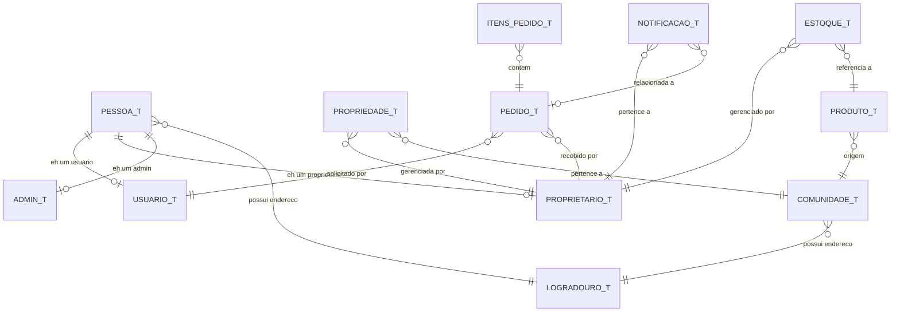

# 04. Modelo de Dados

> Documento completo em [`modelo-dados/Modelo-Conceitual-Banco-Dados.md`](../modelo-dados/Modelo-Conceitual-Banco-Dados.md) — versão 2.0 (agosto 2026).

**SGBD:** PostgreSQL 15+ (Supabase em produção) · Cloud Firestore (front-app)  
**Padrão de Nomenclatura:** snake_case (PostgreSQL), camelCase (Firestore)  
**Padrão de Herança:** Table Per Type (TPT)

---

## 4.1 Estratégia de Persistência por Frontend

| Frontend | Banco | Observação |
|---|---|---|
| front-app (PWA) | Firestore (Firebase SDK) | Dados com IDs gerados pelo Firestore |
| front-site (Site) | PostgreSQL via API Routes Next.js | Modelo relacional abaixo é a fonte de verdade |

---

## 4.2 Tabelas Principais (PostgreSQL)

### Endereços e Pessoas

| Tabela | Descrição | Herança |
|---|---|---|
| `logradouro_t` | Endereços compartilhados (pessoas, comunidades, propriedades) | — |
| `pessoa_t` | Base de pessoas (nome, CPF/CNPJ, email, telefone) | — |
| `usuario_t` | Usuários do sistema | Herda de `pessoa_t` (1:1) |
| `proprietario_t` | Produtores rurais (RG, exibição no site) | Herda de `pessoa_t` (1:1) |
| `admin_t` | Administradores (nível de acesso: SUPER_ADMIN/ADMIN/MODERADOR) | Herda de `pessoa_t` (1:1) |

### Território

| Tabela | Descrição |
|---|---|
| `comunidade_t` | Comunidades quilombolas (status: ATIVA/PENDENTE/REJEITADA) |
| `propriedade_t` | Propriedades rurais vinculadas a proprietário e comunidade |

### Catálogo

| Tabela | Descrição |
|---|---|
| `produto_t` | Sementes/mudas (nome popular, nome científico, tipo, espécie, formato) |
| `estoque_t` | Estoque por proprietário-produto (1:1 por combinação) |

### Operações

| Tabela | Descrição |
|---|---|
| `pedido_t` | Pedidos (venda/troca/doação, status pendente/confirmado/cancelado) |
| `itens_pedido_t` | Itens individuais de cada pedido (1:N com pedido) |

### Alertas e Relatórios

| Tabela | Descrição |
|---|---|
| `notificacao_t` | Notificações geradas automaticamente ao concluir pedido |
| `relatorio_t` | Histórico de relatórios gerados |

### Cadastro e Contas (front-site)

| Tabela | Descrição |
|---|---|
| `solicitacao_cadastro_t` | Solicitações de cadastro de novos produtores pendentes de aprovação |

---

## 4.3 Enums Principais

| Enum | Valores |
|---|---|
| `status_comunidade` | `ATIVA`, `PENDENTE_APROVACAO`, `REJEITADA` |
| `tipo_produto` | `HORTALICA`, `FRUTIFERA`, `FORRAGEIRA`, `CEREAL`, `LEGUMINOSA`, `VERDURA`, `MEDICINAL`, `OUTRAS` |
| `especie_geral` | `FEIJAO`, `MILHO`, `ABOBORA`, `ALFACE`, `ARROZ`, `CEBOLA`, `ALHO`, `OUTRAS` |
| `formato_produto` | `MUDA`, `SEMENTE` |
| `disponibilidade` | `PARA_TROCA`, `PARA_VENDA`, `PARA_DOACAO`, `A_NEGOCIAR`, `INDISPONIVEL` |
| `tipo_pedido` | `VENDA`, `TROCA`, `DOACAO` |
| `status_pedido` | `PENDENTE`, `CONFIRMADO`, `CANCELADO` |
| `tipo_movimentacao` | `ENTRADA`, `SAIDA_VENDA`, `SAIDA_TROCA`, `SAIDA_DOACAO`, `CORRECAO`, `ZERAMENTO` |
| `pesagem` | `SACA`, `KG`, `GRAMA`, `MG`, `UNIDADE` |
| `tipo_relatorio` | `ESTOQUE_SEMENTES`, `PEDIDOS_REALIZADOS` |

---

## 4.4 Regras de Integridade Principais

| # | Regra |
|---|---|
| R1 | Email único por pessoa |
| R2 | CPF/CNPJ único por pessoa |
| R3 | RG único por proprietário |
| R4 | Um único estoque por combinação proprietário-produto |
| R5 | Estoque nunca negativo |
| R6 | Propriedade só é excluída sem dependências |
| R7 | Exclusão de pedido restaura estoque automaticamente |
| R8 | Notificação gerada automaticamente pós-pedido |
| R9 | Datas de auditoria atualizadas por triggers |
| R10 | Senhas armazenadas com BCrypt (aplicação) |

---

## 4.5 Diagrama Entidade-Relacionamento (resumo)

Script SQL completo está em [`modelo-dados/Modelo-Conceitual-Banco-Dados.md`](../modelo-dados/Modelo-Conceitual-Banco-Dados.md) e em [`backend/src/main/resources/db/migration/`](../../backend/src/main/resources/db/migration/).

---

*[Voltar à Wiki](README.md) · [03. Arquitetura e Tecnologias](03-arquitetura-tecnologias.md) · [05. API Backend](05-api-backend.md)*